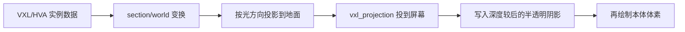

# 坦克阴影渲染方案

本文档面向当前主项目的渲染架构，专门设计一套适用于 `VXL` 载具单位的阴影方案。目标对象以犀牛坦克为代表，但方案应能自然扩展到灰熊、天启、光棱坦克等其它体素载具。

---

## 1. 背景

当前主项目里已经存在两套“阴影思路”：

1. 建筑阴影  
   在 [F:\projects\ra2-replica\src\iso_world.cpp](F:\projects\ra2-replica\src\iso_world.cpp) 中，建筑会在绘制本体前，先绘制一个近似的四边形投影阴影。  
   这是典型的“2D 贴图阴影”。

2. 旧版载具阴影  
   在 [F:\projects\ra2-replica\src\voxel_unit.cpp](F:\projects\ra2-replica\src\voxel_unit.cpp) 中，老的 `drawVoxelUnitInstance(...)` 也会先画一个简单四边形阴影，再画载具贴图。  
   这是“离屏渲染后贴回地图”的阶段遗留逻辑。

但现在主项目里犀牛坦克已经改成：

- `VXL/HVA/VPL/PAL`
- 直接通过 [F:\projects\ra2-replica\src\vpl_box_renderer.cpp](F:\projects\ra2-replica\src\vpl_box_renderer.cpp)
- 在 `world pass` 里直接渲染

也就是说，主项目中的 Rhino 已经不是普通 2D sprite，因此旧的“贴图四边形阴影”不再是最合适的长期方案。

---

## 2. 目标

我们希望这套阴影满足下面几个目标：

1. 阴影跟随载具位置变化。
2. 阴影跟随车体朝向变化，但**不跟随炮塔旋转**。
3. 阴影受固定光方向控制，而不是看起来“贴在模型下面”。
4. 阴影能和地图中的建筑、地面、其它单位正确发生前后遮挡。
5. 阴影方案尽量复用当前 `vpl_renderer` 风格链路，而不是重新起一套完全独立的体素系统。
6. 实现复杂度要分阶段推进，先得到稳定结果，再继续逼近原版观感。

---

## 3. 结论先行

**推荐方案：**

为 `VplBoxRenderer` 增加一个专门的 **Shadow Pass**，使用与当前车体渲染相同的：

- `VXL`
- `HVA`
- `worldTransform`
- `body/turret` 运行时状态

但在 shader 里不再走：

- `VPL`
- `palette`
- `remap`

而是把体素位置沿固定光方向投影到“地面平面”上，直接输出一层半透明深色阴影。

一句话概括：

**“载具本体仍然按 `vpl_renderer` 方式画成立方体；阴影则用同一份体素实例再投影一次，只输出黑色半透明。”**

这是当前工程里最稳、也最自然的一条路。

---

## 4. 为什么不建议继续用 2D 四边形阴影

虽然 2D 阴影实现便宜，但它和当前主项目里的直渲染体素载具有几个天然冲突：

1. 阴影形状过于粗糙  
   坦克朝向一变，真实外轮廓会明显变化；固定四边形阴影会立刻露馅。

2. 和炮管长度、外挂箱、履带外扩不匹配  
   载具顶部轮廓复杂，四边形阴影只能给出“有一团黑影”，不能给出形体信息。

3. 后续扩展性差  
   一旦我们继续做：
   - 炮塔独立旋转
   - 多车型
   - 倾斜地表
   - 更自然的光线方向
   
   四边形阴影会越来越难维护。

所以 2D 阴影可以作为极简 fallback，但不建议作为最终方案。

---

## 5. 推荐方案的核心思想

### 5.1 本体与阴影共用同一份体素实例数据

当前 Rhino 的体素实例已经在 [F:\projects\ra2-replica\src\vpl_box_renderer.cpp](F:\projects\ra2-replica\src\vpl_box_renderer.cpp) 里整理成：

- `body`
- `turret`
- `barrel`

每个部件都有：

- section 列表
- instance buffer
- HVA section 变换

阴影不需要再单独重新解析 VXL。  
我们直接复用这套实例数据，只是在 shader 里换一条位置计算公式。

### 5.2 阴影只关心“位置”，不关心“颜色”

本体渲染当前走的是：

`normal -> VPL -> palette -> remap -> extra_light`

阴影不需要这些。  
阴影 pass 只需要：

1. 取出每个 voxel 的位置
2. 套用同样的 section/world 变换
3. 沿光线投影到地面
4. 输出统一颜色，例如：
   - `rgba = (0, 0, 0, 0.28)`

### 5.3 阴影只跟“车体朝向”走，不跟炮塔旋转走

这点很关键。

在 RTS 里，炮塔和炮管常常会转向目标；但阴影若完全跟着炮塔实时转，会显得很“抖”，而且通常不是玩家最在意的视觉信息。

推荐规则：

1. `body` 参与阴影。
2. `turret` 和 `barrel` 阴影默认不参与，或只保留很弱的影响。

初版建议：

- **只让 `body` 参与阴影**

后续如果我们觉得需要更细，再把炮塔单独加回来。

---

## 6. 具体渲染流程

下面给出推荐的 Shadow Pass 链路。



### 6.1 第一步：保留当前本体渲染链不变

当前 `renderInWorld(...)` 已经能直接把体素载具渲染进主场景。  
这部分不要动。

### 6.2 第二步：新增 `renderShadowInWorld(...)`

在 [F:\projects\ra2-replica\src\vpl_box_renderer.h](F:\projects\ra2-replica\src\vpl_box_renderer.h) 里新增：

```cpp
void renderShadowInWorld(const VplBoxRendererState& state,
                         int viewportWidth,
                         int viewportHeight,
                         float screenCenterX,
                         float screenCenterY,
                         float depthBase01,
                         float depthScale01);
```

这条函数只做阴影，不做本体颜色。

### 6.3 第三步：新增阴影专用 shader

推荐新增两份 shader：

- `shadow_box.vert.glsl`
- `shadow_box.frag.glsl`

也可以先直接把 shader 字符串继续放在 [F:\projects\ra2-replica\src\vpl_box_renderer.cpp](F:\projects\ra2-replica\src\vpl_box_renderer.cpp) 里，等稳定后再拆出去。

### 6.4 第四步：顶点着色器里做“投影到地面”

当前本体 shader 是：

1. `modelPos`
2. `mul_row_vec_mat4`
3. `voxelPos`
4. `vxl_projection`

阴影 shader 改成：

1. 先算 `voxelPos`
2. 再把 `voxelPos` 沿光方向投影到地面
3. 投影后的点再走 `vxl_projection`

推荐公式：

假设地面平面是 `z = 0`，光方向是 `L = normalize(lightDir)`，并且 `L.z < 0`。

对于世界空间点 `P = (x, y, z)`：

```text
t = P.z / -L.z
shadowP = P + L * t
shadowP.z = 0
```

含义很直观：

- 当前体素在空中位置是 `P`
- 沿着光线反方向一直“压”到地面
- 得到阴影落点 `shadowP`

### 6.5 第五步：片元着色器统一输出阴影颜色

片元不查 `VPL`、不查 `palette`。

直接输出例如：

```glsl
FragColor = vec4(0.0, 0.0, 0.0, 0.28);
```

也可以稍微做一点高度衰减，例如：

```glsl
alpha = baseAlpha * clamp(1.0 - projectedHeight * factor, minAlpha, 1.0);
```

但建议先从常量 alpha 开始。

---

## 7. 深度与混合规则

这部分是最容易出 bug 的地方。

### 7.1 当前主项目的深度关系

主项目里建筑本体和 2D 四边形阴影都在 `world pass` 里，使用的深度规则大致是：

- 阴影略“更远”
- 本体略“更近”

例如在 [F:\projects\ra2-replica\src\iso_world.cpp](F:\projects\ra2-replica\src\iso_world.cpp) 中，建筑阴影会用：

- `depth01 + 0.0005f`

### 7.2 推荐的 Rhino 阴影深度规则

对直渲染体素阴影，也建议沿用这个思想：

1. 以 Rhino 的地面锚点算 `anchorDepth`
2. 阴影 pass 用：
   - `shadowDepthBase = depthBase01 + shadowDepthBias`
3. 本体 pass 继续用当前 `depthBase01`

推荐初值：

```cpp
shadowDepthBias = 0.0010f;
```

这样：

- 阴影永远在坦克本体后面
- 但仍然留在地面层附近
- 已经写进深度缓冲的建筑前景也能正常挡住阴影

### 7.3 混合模式

建议阴影 pass：

- 开启 alpha blending
- `glBlendFunc(GL_SRC_ALPHA, GL_ONE_MINUS_SRC_ALPHA)`

### 7.4 深度写入建议

推荐分两种模式：

#### 模式 A：阴影测试深度，但不写深度

优点：

- 不会把后续本体或别的世界对象挡坏
- 更安全

建议：

```cpp
glDepthMask(GL_FALSE);
```

#### 模式 B：阴影既测深度又写深度

不建议作为初版默认。  
容易把地面上的其它世界对象压坏，尤其在我们现在这种“2D 建筑 + 3D 体素混合”的阶段。

**结论：初版用模式 A。**

---

## 8. 哪些部件参与阴影

### 初版建议

只用：

- `body`

不画：

- `turret`
- `barrel`

原因：

1. 视觉最稳定
2. 不会出现炮塔抖动导致阴影不断变化
3. 更像 RTS 中常见的“底盘阴影”
4. 实现最省心

### 第二阶段可选增强

如果需要更贴近 viewer，可以增加开关：

- `castTurretShadow`
- `castBarrelShadow`

但默认仍建议关闭。

---

## 9. 和当前主项目的接入方式

### 9.1 接入点

当前主项目在 [F:\projects\ra2-replica\src\app_main_ui.cpp](F:\projects\ra2-replica\src\app_main_ui.cpp) 的 world pass 中，会先画建筑，再画 Rhino：

- `renderer.beginWorldPass();`
- 建筑循环
- `drawDirectVoxelUnitInstance(...)`

推荐改成：

1. 建筑照旧
2. Rhino 阴影 pass
3. Rhino 本体 pass

也就是：

```text
beginWorldPass
  -> draw buildings
  -> render Rhino shadow
  -> render Rhino body
beginUiPass
```

### 9.2 `drawDirectVoxelUnitInstance(...)` 的职责调整

当前 [F:\projects\ra2-replica\src\voxel_unit.cpp](F:\projects\ra2-replica\src\voxel_unit.cpp) 中，`drawDirectVoxelUnitInstance(...)` 只负责本体。

建议拆成：

```cpp
void drawDirectVoxelUnitShadow(...)
void drawDirectVoxelUnitBody(...)
```

或保留一个入口，但内部顺序明确为：

1. `renderShadowInWorld(...)`
2. `renderInWorld(...)`

这样职责更清楚，也方便后续给不同载具开关阴影。

---

## 10. 可调参数设计

建议给阴影单独引入一份状态：

```cpp
struct VoxelShadowState {
  bool enabled = true;
  float alpha = 0.28f;
  float depthBias = 0.0010f;
  float flattenHeight = 0.0f;
  bool castTurret = false;
  bool castBarrel = false;
};
```

在 ImGui 面板里可先暴露这些调试项：

- `Shadow enabled`
- `Shadow alpha`
- `Shadow depth bias`
- `Cast turret shadow`
- `Cast barrel shadow`

初版不一定全开，但保留这些接口，后面调起来会轻松很多。

---

## 11. 分阶段实现建议

### 阶段 1：最小可用版本

目标：

- Rhino 有稳定阴影
- 阴影不会跟炮塔乱跑
- 阴影不会挡住本体

实现：

1. 新增 `renderShadowInWorld(...)`
2. 新增 shadow shader
3. 只渲染 `body`
4. 固定黑色半透明
5. 深度测试开、深度写关

### 阶段 2：可调试版本

目标：

- 面板可调 alpha / bias
- 可打开 turret shadow 做实验

实现：

1. 新增 `VoxelShadowState`
2. 接入 ImGui 控制面板

### 阶段 3：视觉增强

目标：

- 阴影边缘更自然
- 和建筑/地面融合更好

可选增强：

1. 阴影颜色从纯黑改成带一点地面色调
2. 按高度做轻微 alpha 衰减
3. 对阴影 pass 再加一层轻微缩放或模糊

---

## 12. 当前工程里最适合的最终方案

如果只给一个建议，我会推荐：

**“给 `VplBoxRenderer` 增加专门的 body-only shadow pass，沿固定光方向把体素投影到地面，直接在 world pass 里以半透明黑色绘制，并使用略大于本体的 depth bias。”**

原因是这套方案：

- 能保留当前 `vpl_renderer` 风格直渲染成果
- 能和现在的建筑深度关系自然融合
- 实现复杂度适中
- 视觉收益很高
- 后续还能继续长成更完整的载具阴影系统

---

## 13. 近期实施顺序

建议我们按这个顺序做：

1. 在 [F:\projects\ra2-replica\src\vpl_box_renderer.h](F:\projects\ra2-replica\src\vpl_box_renderer.h) 增加 `renderShadowInWorld(...)`
2. 在 [F:\projects\ra2-replica\src\vpl_box_renderer.cpp](F:\projects\ra2-replica\src\vpl_box_renderer.cpp) 增加 shadow shader
3. 在 [F:\projects\ra2-replica\src\voxel_unit.cpp](F:\projects\ra2-replica\src\voxel_unit.cpp) 里把 `drawDirectVoxelUnitInstance(...)` 拆成 shadow/body 两步
4. 在 [F:\projects\ra2-replica\src\imgui_debug_panel.cpp](F:\projects\ra2-replica\src\imgui_debug_panel.cpp) 增加阴影调试参数

做完这四步，主项目里的 Rhino 阴影就会从“缺失”升级到“有体积感、可调、和世界深度一致”的状态。

